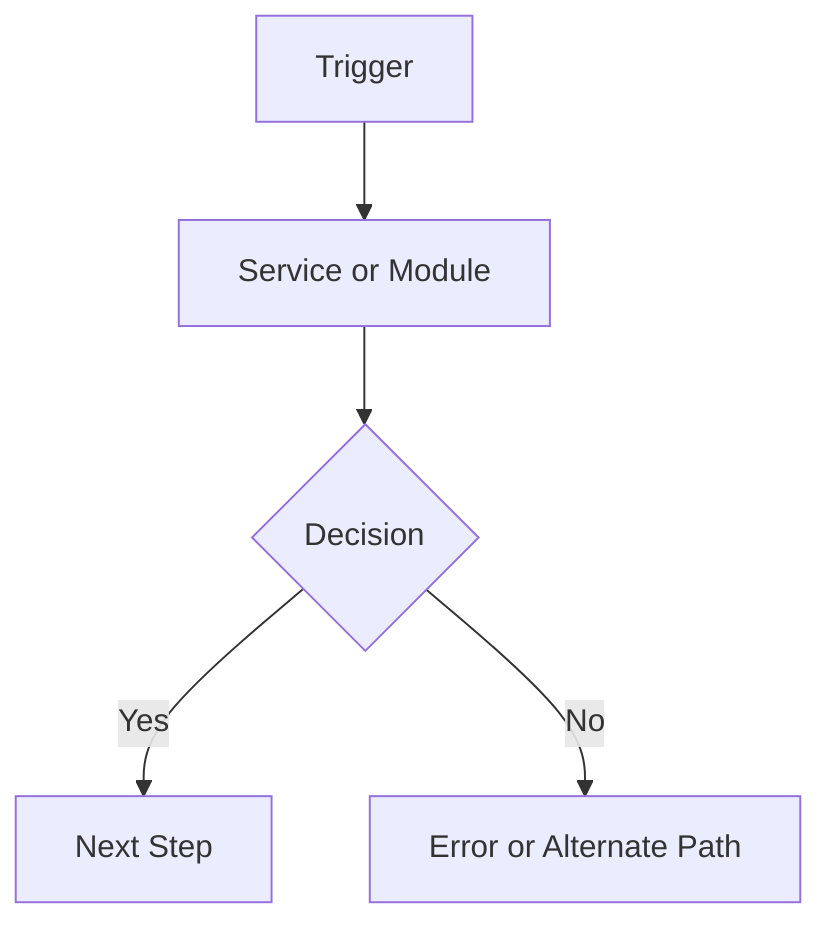

# project-brief

Use this skill to turn a rough idea, problem statement, research notes, or stakeholder context into a completed Project Brief that is useful to a Product Owner creating feature specs in SpecKit or Claude Code.

The brief must not be a thin intake form. It must give the PO enough project background, current-state context, vocabulary, research trail, and technical/code-flow context to work in an unfamiliar product area without guessing.

## Authoritative template

Load and follow `references/template.md` as the authoritative output format.

- Never remove or reorder sections.
- Use `[TBD — {what is missing}]` for unanswered required fields.
- Do not invent business rules, metrics, personas, technical behavior, or decisions.
- If the source material is weak or unsupported, call that out in the brief instead of smoothing it over.
- A brief with no sources, links, or stakeholder inputs is incomplete unless the user explicitly says it is only a placeholder draft.

## Input

Accept flexible input:

- a short prompt like "project brief for X"
- pasted notes, a problem statement, a transcript, or stakeholder feedback
- a file path to existing notes
- a URL to a Confluence page, work tracking system item, SharePoint file, design, or other source
- nothing at all, in which case begin at Stage 0

If input is a file path, read it. If it is a URL, fetch it with the appropriate available connector/tool before drafting. If the user provides pasted text, use it as-is.

## Core behavior

- Work in stages. Ask only for information that is missing or materially unclear.
- Prefer one focused question per stage over a long interrogation.
- Pre-fill from the user's input and referenced material before asking questions.
- Preserve uncertainty. Use `[TBD]`, assumptions, and open questions rather than making the brief look more complete than it is.
- Track source coverage. Record every source consulted in Section 18.
- Treat operational context broadly. Do not assume the work happens only in a store workflow; include store, back office, accounting, corporate, support, customer admin, integrations, batch jobs, APIs, and any other relevant environment.
- Include code-flow context for Claude Code when the project touches existing code, services, APIs, integrations, jobs, data pipelines, or shared components.

## Pre-brief research gate

Before assembling the brief, check whether the user has provided enough context for a real roadmap/project handoff.

At minimum, try to identify:

- Existing work tracking system work items, epics, features, bugs, or linked tickets
- Existing Confluence/SharePoint docs, prior specs, diagrams, or decision records
- Relevant customer cases, support themes, escalation notes, or stakeholder interviews
- Current functionality in the product area
- Existing code, services, APIs, jobs, integrations, or data flows that may be affected
- Key terms, acronyms, product names, and domain vocabulary
- Known owners or subject-matter experts

If none of these are available, ask the user for one or two likely sources before proceeding. If the user wants to proceed anyway, mark the brief as research-light in Section 18 and list the missing source types.

## Workflow

### Stage 0 — Framing

Use only if the input is sparse.

Ask: "What's the project title, and in one or two sentences what problem are we trying to solve?"

Then extract:

- Project title
- Product or product area, if derivable
- Today's date from context
- Proposed file slug in kebab-case
- Draft status, defaulting to `Draft`

Confirm the title and product/product area in one sentence, then continue.

### Stage 1 — Research & sources

Determine what evidence exists before shaping the brief.

Ask for or collect:

- work tracking system items or roadmap links
- Existing docs/specs/decision records
- Customer/support/stakeholder inputs
- Relevant code areas, repositories, services, or APIs
- Known SMEs or reviewers

If sources are provided, summarize what each source contributes. If sources are missing, mark gaps explicitly and continue only if the user confirms or the brief is intentionally preliminary.

### Stage 2 — Problem, current state, and vocabulary (Sections 1-3)

Pre-fill what you can, then ask for missing context:

- Section 1: problem, affected users, business/user impact, why now
- Section 2: current functionality, current workflow/system behavior, known limitations, whether this is net-new/replacement/enhancement
- Section 3: key terminology, product names, acronyms, domain concepts, integration names, and ambiguous labels

Do not let Section 1 carry all context. Section 2 should make the current state understandable to someone new to the area.

### Stage 3 — Operational context, users, and scenarios (Sections 4-6)

Ask for:

- All operational contexts where this matters, not just store workflow
- Personas/roles, including non-store roles when applicable
- User/system scenarios and triggers
- Happy path in 3-7 steps

If the user only names one workflow, ask whether back office, accounting, support, admin, integration, or automated system flows are also affected.

### Stage 4 — Acceptance, data/integration details, and success metrics (Sections 7-9)

Ask for:

- 3-5 acceptance conditions that prove the feature works
- Data or integration details that are not already obvious from the problem and scenarios
- Success metrics in Operational, System, and Business buckets

Keep Section 8 focused on distinct details only. Avoid repeating the user flow. Capture things like data formats, source/target systems, volume, sync behavior, permissions, audit requirements, API contracts, file formats, reporting outputs, or integration-specific output expectations.

### Stage 5 — Code-flow / technical context diagram (Section 10)

If the project touches existing code, services, APIs, integrations, data pipelines, or jobs, include a Mermaid flowchart that shows the relevant current or proposed code/system flow.

Ask for missing technical context only if needed:

- Entry point: UI action, API call, event, scheduled job, import/export, or webhook
- Main service/module/component boundaries
- Downstream services, APIs, databases, queues, files, or third-party systems
- Decision points, validations, transformations, async steps, and error paths
- Known repo/file/module names, if available

Render as a fenced Mermaid block:

Rules:

- Label unknown nodes with `[TBD — ...]` rather than inventing implementation details.
- Prefer system/component names over vague labels like "backend" when known.
- Include external systems and data stores as explicit nodes.
- Include error/fallback paths when known.
- If a Mermaid diagram is not applicable, write `[Not applicable — no code/system flow identified for this brief]` and explain why.

### Stage 6 — Guardrails and edge cases (Sections 11-12)

Ask for:

- Device/browser/platform expectations, if relevant
- Latency/performance expectations
- Offline/sync behavior
- Permission/security/audit constraints
- Workflow integrity concerns
- enterprise software company design system alignment: Full / Partial / Transitional / Intentionally product-specific / Not applicable
- 2-5 edge cases or failure states

Use fixed-choice prompting only for the design-system alignment field.

### Stage 7 — Decisions, unknowns, ownership, and risks (Sections 13-16)

Ask for:

- Already-made decisions that should not be relitigated
- Known unknowns to resolve during discovery/spec writing
- Decision owners and approvers, if different from the default template guidance
- Top risks across workflow, data, integration, performance, migration, rollout, and customer impact

If ownership is not provided, use the boilerplate in `references/template.md` and mark named owners as TBD.

### Stage 8 — SpecKit / Claude Code handoff block (Section 17)

Synthesize Section 17 from the brief:

- Primary workflow from Sections 1, 4, and 6
- Current-state constraints from Section 2
- Key personas from Section 5
- Must-pass scenarios from Sections 6 and 7
- Data/integration constraints from Section 8
- Code-flow context from Section 10
- Hard guardrails from Section 11
- Known edge cases from Section 12

Show this block for user review before finalizing. This is the section most likely to compress or distort prior context, so ask for a sanity check.

### Stage 9 — Assemble and save

1. Assemble the full brief using `references/template.md`.
2. Save to `./{slug}-project-brief.md` unless the user specifies another location.
3. Report the file path.
4. Provide a short list of remaining `[TBD]` items and missing source categories.

## Output rules

- Follow `references/template.md` exactly for section numbers, titles, dividers, and labels.
- Status defaults to `Draft` unless the user says otherwise.
- PM field stays blank unless the user provides a name.
- Date uses today's date from context.
- Never skip required sections.
- Keep the brief readable for a PO. Avoid turning it into an engineering design doc, but include enough technical/code-flow context for Claude Code work.
- Use bullets where the template uses bullets and prose where the template uses prose.

## Quality bar

A good project brief should let a PO answer:

- Why are we doing this?
- What already exists today?
- Who uses or is affected by it?
- What vocabulary do I need to understand the area?
- What sources support this brief?
- What systems/code paths are likely involved?
- What does success look like?
- What is still unknown?

## What to avoid

- Do not batch every section into one giant question list.
- Do not assume all enterprise software company work is store-facing.
- Do not bury current-state context inside the problem statement.
- Do not duplicate data prompts that are already answered by scenarios.
- Do not invent code flows, system names, personas, metrics, or decisions.
- Do not finalize a research-light brief without clearly flagging the missing evidence.
- Do not commit or open PRs unless the user explicitly asks.
